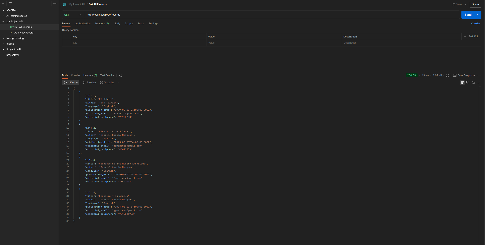
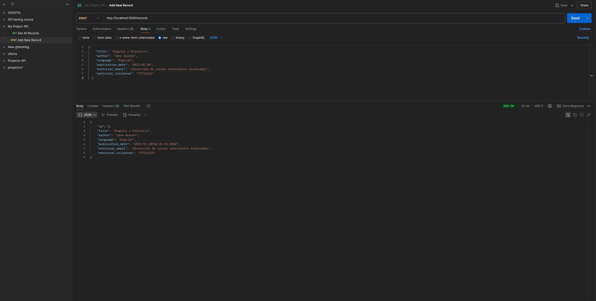

# proyecto final

este proyecto es una aplicación full stack que se desarrolló utilizando postgresql como base de datos, express para el backend y react para el frontend.

## descripción del proyecto

la aplicación permite gestionar registros mediante un formulario que incluye los siguientes campos: título, autor, idioma, fecha de publicación, correo electrónico editorial y número celular editorial. los datos ingresados se almacenan en la base de datos postgresql y se muestran en una tabla con filas alternadas para mejorar la visualización.

## tecnología utilizada

- postgresql: gestión de la base de datos.
- express: framework para el desarrollo del backend.
- react: biblioteca para el desarrollo del frontend.
- node.js: entorno de ejecución para javascript.
- css: diseño y estilo de la interfaz de usuario.

## estructura del proyecto

el proyecto se organiza en dos carpetas principales:

- **backend**: contiene la aplicación de express, la conexión a la base de datos y los endpoints.
- **frontend**: contiene la aplicación de react para la interfaz de usuario.

## configuración y ejecución

### backend

1. cambiar al usuario postgres y acceder a psql:
sudo -i -u postgres psql

2. crear la base de datos y el usuario:
```sql
create database proyecto0;
create user proyecto with password 'tu_contraseña';
grant all privileges on database proyecto0 to proyecto;
```

salir de psql:
\q

## en la carpeta backend, instalar dependencias y ejecutar la aplicación:

cd backend
npm install
node app.js

## para desarrollo se puede usar:

npm run dev

### frontend
## en la carpeta frontend, instalar dependencias y ejecutar la aplicación:

cd frontend
npm install
npm start
la aplicación se abrirá en http://localhost:3000.
pruebas con postman


se realizaron pruebas a los endpoints del backend utilizando postman. a continuación se incluyen las capturas de pantalla de dichas pruebas:

obtener todos los registros (get /records):



agregar un registro (post /records):


